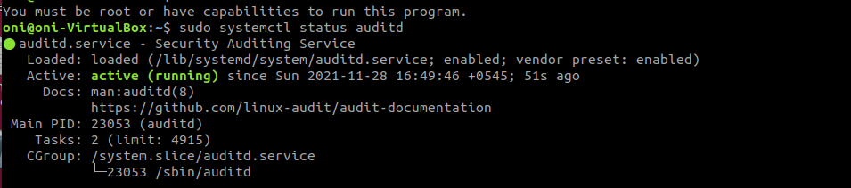

# Logging

Assignments

1. List some logging and visualization tools available in the market with the preferred senario to use one over other.
2. Mention 10 best practises when logging. Why is log formatting necessary?
3. Create a file in your system. Whenever a someone performs some action(read, write, execute) on that file, the event should be logged somewhere.
4. install logstash in your system. download a sample nginx log from [https://github.com/elastic/examples/blob/master/Common%20Data%20Formats/nginx_logs/nginx_logs](https://github.com/elastic/examples/blob/master/Common%20Data%20Formats/nginx_logs/nginx_logs) , parse the logs using logstash. The parsed output must contain the geogriphical information like country, state etc. that the request is originating from. save the parsed output to a file in your system.

## Q.1.

**Splunk**

Use cases:

- For network monitoring and detecting security issues

**ElasticSearch**

Use cases:

- Large volume of log and performance is of importance

**Kibana:**

Use cases:

- When you need to visualize the data
- Generate reports
- Analytics and insights are needed

**Datadog:**

- ease of use
- faster time to market
- managed service

## Q.2.

Some of the logging best practices are as:

- Never ever log sensitive information
- Always log in text format and try to follow a format for eg syslog
- Use timestamp for every event and make the time uniform by logging UTC
- Use categorization and severity for eg; CRITICAL, DEBUG, INFO etc
- Log locally to files so that logs are not lost due to backpressure
- Rotate the logs using rotation policy. Your disk will be full if you go on collecting everything. So rotate logs at periodic interval.
- Make the logs human readable and as developer friendly as possible.
- Identify the sources that generated the log and include it in the logs.
- Add context to your log messages
- Don't log to too much or too little
- Make you log easy to parse
- Log for compliance purposes as well
- Centralize all of your logs

References:

[https://dev.splunk.com/enterprise/docs/developapps/addsupport/logging/loggingbestpractices/](https://dev.splunk.com/enterprise/docs/developapps/addsupport/logging/loggingbestpractices/)

[https://www.comparitech.com/net-admin/log-management-tools/](https://www.comparitech.com/net-admin/log-management-tools/)

[https://www.sentinelone.com/blog/the-10-commandments-of-logging/](https://www.sentinelone.com/blog/the-10-commandments-of-logging/)

[https://www.graylog.org/post/log-formats-a-complete-guide](https://www.graylog.org/post/log-formats-a-complete-guide)

## Q.3.

### Step 1: Setup auditd

1.1 Install `auditd`

```bash
	sudo apt install auditd
```

1.2 Enable it be started at boot time

```bash
systemctl enable auditd
```



1.2 Optional

Configure the `auditd` configuration file stored at `sudo nano /etc/audit/auditd.conf`

### Step 2: Watch the file

2.1 Create a file

```bash
touch sample_file
echo "anything" >> sample_file
```

2.2 Watch the file using `auditctl`

```bash
sudo auditctl -w ~/sample_file -p rwxa -k keyforsample
```

`-w` is for watch

`-p rwxa` is for logging read, write, execute and append events

`-k` is any arbitrary key to filter the results/logs/rules.

2.3 Open the file to simulate an file event

```bash
nano sample_file
```

2.3 Watch the logs at  `/var/log/audit/audit.log` by  default, the audit system logs audit messages to the `/var/log/audit/audit.log` file.

```bash
sudo cat /var/log/audit/audit.log | grep "sample_file"
```


2.4 Search the events using key specified previously

```bash
sudo ausearch -k keyforsample
```


This shows all the events that have been tagged/labelled with key `keyforsample` .

Reference:

[https://www.digitalocean.com/community/tutorials/how-to-use-the-linux-auditing-system-on-centos-7](https://www.digitalocean.com/community/tutorials/how-to-use-the-linux-auditing-system-on-centos-7)

## Q.4.

### Step 1: Install Dependencies and sample log

1.1 Install java

```jsx
sudo apt install default-jdk
```

1.2 Download sample log

```jsx
wget -q https://github.com/elastic/examples/raw/master/Common%20Data%20Formats/nginx_logs/nginx_logs
```


### Step 2: Install logstash

Follow the documentation at [https://www.elastic.co/guide/en/logstash/current/installing-logstash.html](https://www.elastic.co/guide/en/logstash/current/installing-logstash.html) 

The commands below adds the elastic repository and the installs logstash from that repo

```bash
wget -qO - https://artifacts.elastic.co/GPG-KEY-elasticsearch | sudo apt-key add -
sudo apt-get install apt-transport-https
echo "deb https://artifacts.elastic.co/packages/7.x/apt stable main" | sudo tee -a /etc/apt/sources.list.d/elastic-7.x.list
sudo apt-get update && sudo apt-get install logstash
```

After installation enable logstash to be started at boot time

```bash
sudo systemctl enable logstash
sudo systemctl start logstash
```


### Step 3: Parse the logs

3.1 Create a logstash config file will the following content

```jsx
input {

#use input plugin of type file
file {
type => "nginx-log"   #specify that the logs are of nginx
path => "/home/oni/nginx_logs"           
start_position => "beginning"
}

}

filter {

grok {
match => { "message" => ["%{IP:clientip} - - \[%{HTTPDATE:timestamp}\] \"(?:%{WORD:verb} %{NOTSPACE:request}(?: HTTP/%{NUMBER:httpversion})?|-)\" %{NUMBER:response} %{NUMBER:bytes} \"-\" \"%{GREEDYDATA:os}\""]}
}

geoip{
source => "clientip"
}
	
}

output {
file {
path => "/home/oni/parsed_logs"  # output the parsed, filtered log to file named parsed_logs
}
}

```


3.2 Goto the logstash `HOME` directory

```bash
cd /usr/share/logstash
nano sample-parse.conf  # paste the above configuration here
```

3.3 Test the config file you just created

```bash
bin/logstash -f sample-parse.conf --config.test_and_exit
```

The `--config.test_and_exit` option parses your configuration file and reports any errors.

3.4  Restart Logstash 

```bash
sudo bin/logstash -f sample-parse.conf --config.reload.automatic
```


3.3 Parsed output is as follow:


The geoip filter plugin is working as shown in the output
